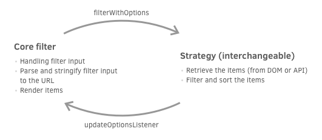

# Filter strategies

## [Demo](https://wiljanslofstra.com/filter-strategies)
- [Test with 1000 items](https://wiljanslofstra.com/filter-strategies?total-items=1000)
- [Test with 5000 items](https://wiljanslofstra.com/filter-strategies?total-items=5000)
- [Test with 10000 items](https://wiljanslofstra.com/filter-strategies?total-items=10000)

Filtering system written in vanilla Javascript. The system is separated in two parts, a part that
takes care of input and rendering. And an interchangeable part that retrieves, filters and sorts
the items. The interchangeable part (strategy) could for example retrieve the items from the DOM,
or get them from an API.

At the moment only one strategy is implemented, a local strategy. This will use items retrieved
from the DOM. This could be used for smaller datasets, because larger datasets will also make the
document larger in filesize.

## Roadmap
- [ ] Pagination
- [ ] Add remote strategy (fetch items from an API)
- [x] Add filter remove/reset button and implementation
- [ ] Add a nice price slider (at the moment we only have two input fields)
- [ ] Create a real life example
